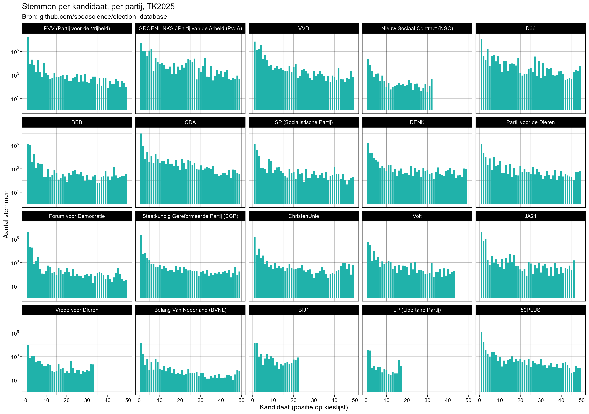
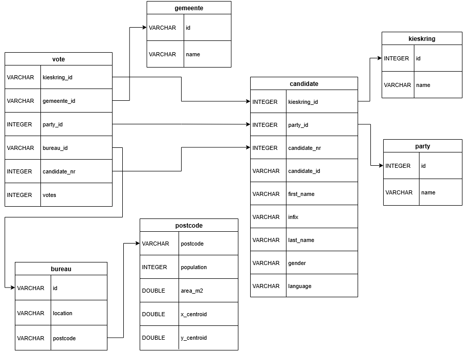

# Analysis-ready election votes database
[](https://www.repostatus.org/#wip) [](https://cran.r-project.org/) [](https://duckdb.org)

The Dutch government makes all data from the general elections (Tweede Kamerverkiezingen) available. For example:
- Candidate list of the elections in 2025: [kiesraad.nl](https://www.kiesraad.nl/adviezen-en-publicaties/publicaties/2025/09/25/overzicht-kandidatenlijsten-tweede-kamerverkiezing-2025)
- Election results of the elections in 2025: [kiesraad.nl](https://www.kiesraad.nl/adviezen-en-publicaties/publicaties/2025/11/07/digitale-tellingsbestanden-gemeentelijk---en-hoofdstembureaus)

The problem: the format is quite horrible, because these data are not created with analysis in mind, but rather reliability, trustworthiness, and auditability on a local scale.

The goal of this repository is to create an efficient analysis-ready relational database, which can be used for all kinds of election analysis, focussing on political parties, municipalities, or candidates. The smallest unit of analysis is the "stembureau" which is the locations where voting takes place. This data is also ready to be connected to external data sources through clear ID variables, efficient subtables. 

> [!WARNING]
> This is work in progress, the database was not validated; the data pipeline is provided as-is. There are several inaccuracies with this data, please do your own consistency / accuracy checks!

This enables plotting and analysis!




## Using the database

The database was created using [duckdb](https://duckdb.org), a fast and portable analytics database software. The latest version of the database is available on the [releases page](https://github.com/sodascience/election_database/releases/). The database can be queried directly in the `duckdb` CLI, but it also has excellent support in other programming languages e.g., R or python, so it's easy to integrate into a standard analysis workflow:

```R
library(tidyverse)
library(duckdb)

dbc <- dbConnect(duckdb("votes_tk2023.duckdb", read_only = TRUE))

# note that these tbls are "lazy"
vote_tbl  <- tbl(dbc, "vote") 
party_tbl <- tbl(dbc, "party")

# computation of this join and sort happens entirely in duckdb
left_join(vote_tbl, party_tbl, by = join_by(party_id == id)) |> 
    arrange(bureau_id, party_id, candidate_nr) |>
    head(100) |> 
    collect()
```
```
# A tibble: 100 × 7  
   kieskring_id gemeente_id bureau_id   party_id candidate_nr votes name 
   <chr>        <chr>       <chr>          <int>        <int> <int> <chr>
 1 1            0014        0014::SB100        1            1   110 VVD  
 2 1            0014        0014::SB100        1            2     5 VVD  
 3 1            0014        0014::SB100        1            3     1 VVD  
 4 1            0014        0014::SB100        1            4     4 VVD  
 5 1            0014        0014::SB100        1            5     1 VVD  
 6 1            0014        0014::SB100        1            6     2 VVD  
 7 1            0014        0014::SB100        1            7     1 VVD  
 8 1            0014        0014::SB100        1            8     1 VVD  
 9 1            0014        0014::SB100        1            9     5 VVD  
10 1            0014        0014::SB100        1           10     0 VVD  
# ℹ 90 more rows
# ℹ Use `print(n = ...)` to see more rows
```


### Tables
The available tables in the database are the following:
- `bureau` contains location and postcode info of the "stembureaus"
- `candidate` contains candidate information (party, name, gender, ...) for each "kieskring"
- `gemeente` links municipality ID to its name
- `kieskring` links the kieskring (electoral region) to its name
- `party` contains the names and IDs of the political parties
- `postcode` contains some information with spatial coordinates for each postal code area
- `vote` contains the number of votes cast at each "stembureau" for each candidate

### Analysis view
The main analytical table is prepared as a [view](https://en.wikipedia.org/wiki/View_(SQL)) using the abovementioned tables as its source. The main table has the following columns:

```sh
> duckdb votes.duckdb -c "SHOW main;"
```
```
┌──────────────┬─────────────┬─────────┬─────────┬─────────┬─────────┐
│ column_name  │ column_type │  null   │   key   │ default │  extra  │
│   varchar    │   varchar   │ varchar │ varchar │ varchar │ varchar │
├──────────────┼─────────────┼─────────┼─────────┼─────────┼─────────┤
│ kieskring_id │ VARCHAR     │ YES     │ NULL    │ NULL    │ NULL    │
│ kieskring    │ VARCHAR     │ YES     │ NULL    │ NULL    │ NULL    │
│ gemeente_id  │ VARCHAR     │ YES     │ NULL    │ NULL    │ NULL    │
│ gemeente     │ VARCHAR     │ YES     │ NULL    │ NULL    │ NULL    │
│ bureau_id    │ VARCHAR     │ YES     │ NULL    │ NULL    │ NULL    │
│ location     │ VARCHAR     │ YES     │ NULL    │ NULL    │ NULL    │
│ postcode     │ VARCHAR     │ YES     │ NULL    │ NULL    │ NULL    │
│ party_id     │ INTEGER     │ YES     │ NULL    │ NULL    │ NULL    │
│ party        │ VARCHAR     │ YES     │ NULL    │ NULL    │ NULL    │
│ candidate_nr │ INTEGER     │ YES     │ NULL    │ NULL    │ NULL    │
│ candidate_id │ VARCHAR     │ YES     │ NULL    │ NULL    │ NULL    │
│ first_name   │ VARCHAR     │ YES     │ NULL    │ NULL    │ NULL    │
│ infix        │ VARCHAR     │ YES     │ NULL    │ NULL    │ NULL    │
│ last_name    │ VARCHAR     │ YES     │ NULL    │ NULL    │ NULL    │
│ gender       │ VARCHAR     │ YES     │ NULL    │ NULL    │ NULL    │
│ language     │ VARCHAR     │ YES     │ NULL    │ NULL    │ NULL    │
│ votes        │ INTEGER     │ YES     │ NULL    │ NULL    │ NULL    │
│ party_votes  │ HUGEINT     │ YES     │ NULL    │ NULL    │ NULL    │
│ bureau_votes │ HUGEINT     │ YES     │ NULL    │ NULL    │ NULL    │
│ x_centroid   │ DOUBLE      │ YES     │ NULL    │ NULL    │ NULL    │
│ y_centroid   │ DOUBLE      │ YES     │ NULL    │ NULL    │ NULL    │
│ population   │ INTEGER     │ YES     │ NULL    │ NULL    │ NULL    │
│ area_m2      │ DOUBLE      │ YES     │ NULL    │ NULL    │ NULL    │
├──────────────┴─────────────┴─────────┴─────────┴─────────┴─────────┤
│ 23 rows                                                  6 columns │
└────────────────────────────────────────────────────────────────────┘
```

The first and last columns of the first few rows look like this:

```sh
> duckdb votes.duckdb -c "select * from main limit 6;"
```
```
┌──────────────┬───────────┬─────────────┬───────────┬─────────────┬──────────┬───┬───────┬─────────────┬──────────────┬────────────────────┬───────────────────┬────────────┬───────────────────┐
│ kieskring_id │ kieskring │ gemeente_id │ gemeente  │  bureau_id  │ location │ . │ votes │ party_votes │ bureau_votes │     x_centroid     │    y_centroid     │ population │      area_m2      │
│   varchar    │  varchar  │   varchar   │  varchar  │   varchar   │ varchar  │   │ int32 │   int128    │    int128    │       double       │      double       │   int32    │      double       │
├──────────────┼───────────┼─────────────┼───────────┼─────────────┼──────────┼───┼───────┼─────────────┼──────────────┼────────────────────┼───────────────────┼────────────┼───────────────────┤
│ 1            │ Groningen │ 0014        │ Groningen │ 0014::SB443 │ Kajuit 4 │ . │     0 │           3 │         1074 │ 237557.97857383578 │ 584304.9422795495 │         25 │ 5945.412247211905 │
│ 1            │ Groningen │ 0014        │ Groningen │ 0014::SB443 │ Kajuit 4 │ . │     0 │           3 │         1074 │ 237557.97857383578 │ 584304.9422795495 │         25 │ 5945.412247211905 │
│ 1            │ Groningen │ 0014        │ Groningen │ 0014::SB443 │ Kajuit 4 │ . │     0 │           1 │         1074 │ 237557.97857383578 │ 584304.9422795495 │         25 │ 5945.412247211905 │
│ 1            │ Groningen │ 0014        │ Groningen │ 0014::SB443 │ Kajuit 4 │ . │     0 │           1 │         1074 │ 237557.97857383578 │ 584304.9422795495 │         25 │ 5945.412247211905 │
│ 1            │ Groningen │ 0014        │ Groningen │ 0014::SB443 │ Kajuit 4 │ . │     0 │          42 │         1074 │ 237557.97857383578 │ 584304.9422795495 │         25 │ 5945.412247211905 │
│ 1            │ Groningen │ 0014        │ Groningen │ 0014::SB443 │ Kajuit 4 │ . │     0 │          42 │         1074 │ 237557.97857383578 │ 584304.9422795495 │         25 │ 5945.412247211905 │
├──────────────┴───────────┴─────────────┴───────────┴─────────────┴──────────┴───┴───────┴─────────────┴──────────────┴────────────────────┴───────────────────┴────────────┴───────────────────┤
│ 6 rows                                                                                                                                                                   23 columns (13 shown) │
└────────────────────────────────────────────────────────────────────────────────────────────────────────────────────────────────────────────────────────────────────────────────────────────────┘
```

### Full schema
The schema of the actual tables in the database looks like so. Arrows have been added manually to indicate which tables can be joined. There are no formal primary and foreign keys in the database because it hampers [performance](https://duckdb.org/docs/stable/guides/performance/schema#constraints).




## Creating the database

#### Prerequisites
To create the database, you need a recent version of R with the following packages:
```R
install.packages(c("tidyverse", "emld", "digest", "nanoparquet", "sf"))
```
And you need to install the `duckdb` CLI: [duckdb.org/install](https://duckdb.org/install/).

#### Download the source files
Go to the file [raw_data/source.txt](raw_data/source.txt) and download the source files from the URLs there. Specifically, download the municipal `.eml.xml` files for the actual votes, the `.csv` file for the candidates, and name the postal code information `pc6.gpkg`.

After downloading the source files, the repo should look like this:

```
📁 election_database/
├── 📖 README.md
├── LICENSE
├── .gitattributes
├── .gitignore
├── 📄 01_eml_to_votes.R
├── 📄 02_votes_to_parquet.R
├── 📄 03_model.R
├── 📄 03_query.R
├── 📄 04_create_duckdb.sql
├── voting_analysis.Rproj
├── 📁 raw_data/
│   ├── .gitignore
│   ├── 📜 Overzicht+Kandidatenlijsten_TK2025_csv.csv
│   ├── 📦 pc6.gpkg
│   ├── source.txt
│   └── 📁 Gemeente tellingen/
│       ├── 📜 Telling_TK2025_gemeente_Aa_en_Hunze.eml.xml
│       ├── 📜 Telling_TK2025_gemeente_Aalsmeer.eml.xml
│       ├── ...
│       ├── 📜 Telling_TK2025_openbaar_lichaam_Saba.eml.xml
│       └── 📜 Telling_TK2025_openbaar_lichaam_Sint_Eustatius.eml.xml
├── 📁 img/
│   ├── 📊 schema.png
│   ├── schema.drawio
│   └── 📊 votes_per_party.png
└── 📁 processed_data/

# made with J535D165/scitree
```


#### Run the pre-processing pipeline
First, parse and extract the information we need from the municipal EML files:
```sh
Rscript 01_eml_to_votes.R
```
Then, convert the results to parquet files of each individual table:
```sh
Rscript 02_votes_to_parquet.R
```

The `processed_data` folder should now look like this:

```
📁 processed_data/
├── 📁 gemeente/
│   ├── 📦 0014.rds
│   ├── 📦 0034.rds
│   ├── 📦 0037.rds
│   ├── ...
│   ├── 📦 1992.rds
│   ├── 📦 9001.rds
│   └── 📦 9010.rds
└── 📁 votes_data/
    ├── 📦 bureau.parquet
    ├── 📦 candidate.parquet
    ├── 📦 gemeente.parquet
    ├── 📦 kieskring.parquet
    ├── 📦 party.parquet
    ├── 📦 postcode.parquet
    └── 📦 vote.parquet
```

Last, load the resulting parquet files and create the `main` view using duckdb:

```sh
duckdb < 04_create_duckdb.sql
```

the file `votes.duckdb` should now appear in the `processed_data` folder.


## Contact

This is a project by the [ODISSEI Social Data Science team](https://odissei-soda.nl/). Do you have questions, suggestions, or remarks on the technical implementation? Create an issue in the issue tracker or feel free to contact [Erik-Jan van Kesteren](https://github.com/vankesteren). 

 
